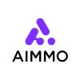

<picture>
    <source
    srcset="https://capsule-render.vercel.app/api?type=waving&color=5C8DD4&text=devbruce&fontAlign=50&fontAlignY=30&fontSize=30&desc=Software%20Engineer&descAlign=50&descAlignY=55&descSize=15&fontColor=C6D1D8"
    media="(prefers-color-scheme: dark)"
    />
    <source
    srcset="https://capsule-render.vercel.app/api?type=waving&color=0F3C64&text=devbruce&fontAlign=50&fontAlignY=30&fontSize=30&desc=Software%20Engineer&descAlign=50&descAlignY=55&descSize=15"
    media="(prefers-color-scheme: light), (prefers-color-scheme: no-preference)"
    />
    
</picture>

    
    
    
    
    
    <!--  -->

 

<picture>
    <source
    srcset="https://github-readme-stats.vercel.app/api?username=devbruce&show_icons=true&theme=github_dark&hide_title=true&rank_icon=github&hide_border=false"
    media="(prefers-color-scheme: dark)"
    />
    <source
    srcset="https://github-readme-stats.vercel.app/api?username=devbruce&show_icons=true&theme=buefy&hide_title=true&rank_icon=github&hide_border=false"
    media="(prefers-color-scheme: light), (prefers-color-scheme: no-preference)"
    />
    
</picture>

 

<h2>🎞 Career</h2>

<table>
<thead>
  <tr>
    <th>🏢 Company</th>
    <th>🧑🏻‍💻 Position</th>
    <th>🗓️ Period</th>
  </tr>
</thead>
<tbody>
  <tr>
    <td>
      
      <a href="https://www.nexon.com/" target="_blank" rel="noopener noreferrer">NEXON KOREA</a>
    </td>
    <td>Backend Engineer</td>
    <td><i>2024.11 ~ current</i></td>
  </tr>
  <tr>
    <td>
      
      <a href="https://42dot.ai/" target="_blank" rel="noopener noreferrer">42dot</a>
    </td>
    <td>Backend Engineer</td>
    <td><i>2024.05 ~ 2024.11</i></td>
  </tr>
  <tr>
    <td rowspan="2">
      
      <a href="https://riiid.com/" target="_blank" rel="noopener noreferrer">Riiid</a>
    </td>
    <td>DevOps Engineer</td>
    <td><i>2024.02 ~ 2024.04</i></td>
  </tr>
  <tr>
    <td>Machine Learning Engineer</td>
    <td><i>2023.03 ~ 2024.02</i></td>
  </tr>
  <tr>
    <td>
      
      <a href="https://www.wadiz.kr/" target="_blank" rel="noopener noreferrer">wadiz</a>
    </td>
    <td>AI Engineer</td>
    <td><i>2022.03 ~ 2023.03</i></td>
  </tr>
  <tr>
    <td rowspan="2">
      
      <a href="https://www.aimmo.ai/" target="_blank" rel="noopener noreferrer">AIMMO</a>
    </td>
    <td>Data Scientist</td>
    <td><i>2019.12 ~ 2022.02</i></td>
  </tr>
  <tr>
    <td>Data Scientist Intern</td>
    <td><i>2019.09 ~ 2019.11</i></td>
  </tr>
</tbody>
</table>

 

    

<picture>
    <source
    srcset="https://capsule-render.vercel.app/api?type=waving&section=footer&color=5C8DD4&fontColor=C6D1D8"
    media="(prefers-color-scheme: dark)"
    />
    <source
    srcset="https://capsule-render.vercel.app/api?type=waving&color=0F3C64&section=footer"
    media="(prefers-color-scheme: light), (prefers-color-scheme: no-preference)"
    />
    
</picture>
